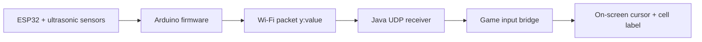

# Whack-a-Mole Wireless Sensor Demo

This project is currently set up as a wireless proof-of-concept.

Current working pieces:
- the ESP32 and ultrasonic sensor firmware upload successfully over USB
- the ESP32 can run from an external battery after upload
- the ESP32 sends the sensor position over Wi-Fi
- the Java program receives the wireless position data
- the game shows a simple grid with a visible cursor marker
- the game has start and stop controls

The goal of this version is to prove the full hardware-to-screen loop:

ESP32 sensor reading -> Wi-Fi packet -> Java game -> cursor update -> visible grid

## Current behavior

The ESP32 now sends BOTH sensor readings over Wi-Fi in a single packet:

```text
Sensor 1: 45.0 cm Sensor 2: No echo
```

This version does TRIANGULATION (strictly, trilateration): the player's
position is computed by geometrically fusing both sensors' ranges, which is
the "calibrated spatial positioning" the brief asks for.

Physical rig (all cm):

```text
wall:  |----S1----------S2----|     S1 at x=25, S2 at x=75 (baseline 50)
       :      dead zone       :     0-50 out from the wall
       +----------+-----------+
       |  BOX 1   |   BOX 2   |     both boxes 50-100 deep,
       | (x 0-50) | (x 50-100)|     side by side across a 100 cm field
       +----------+-----------+
```

Each range reading is a circle around its sensor; the two circles intersect
at exactly one point in front of the wall:

```text
xFromS1 = (r1^2 - r2^2 + B^2) / (2B)      B = 50 cm baseline
y       = sqrt(r1^2 - xFromS1^2)
```

The triangulated x picks the box (boundary at x = 50, with +/- 5 cm
hysteresis so standing on the line doesn't flicker). The horizontal position
CANNOT be derived from either sensor alone — only from fusing both. The game
window shows the live computed `fix: x=..cm y=..cm (triangulated)` readout so
this can be pointed at during the demo.

Fallbacks and filters:

- only one sensor echoes -> the player must be inside that sensor's beam, so
  they get that sensor's half of the field (keeps the game playable at the
  field edges where the beams don't overlap)
- ranges under 45 cm or over 130 cm -> ignored (dead-zone object / empty field)
- circle pair that doesn't intersect (noise) -> ignored
- computed position outside the field (+15 cm tolerance) -> ignored

Example values:

```text
Sensor 1: 75.0 cm Sensor 2: 90.1 cm -> x=25 y=75 -> Box 1
Sensor 1: 90.1 cm Sensor 2: 75.0 cm -> x=75 y=75 -> Box 2
```

The old single-value `y:75.0` format contains no x information and is ignored
(the on-screen fix label says so).

## Table-scale test mode (Assessment 1 mini demo)

`SensorInputBridge` has a `TABLE_TEST` flag (currently **true**). It selects a
1:2 scale rig that fits on a table, tracked with a hand or a bottle instead of
a person:

```text
edge:  |--S1------S2--|      S1 at x=12.5, S2 at x=37.5 (baseline 25)
       :   dead zone  :      0-25 cm from the sensors
       +------+-------+
       | BOX1 | BOX2  |      both boxes 25-50 cm deep,
       |(0-25)|(25-50)|      side by side across a 50 cm field
       +------+-------+
```

Tabletop numbers: valid ranges 20-70 cm, box split at x = 25 with +/- 3 cm
hysteresis. Everything is exactly half the floor-scale geometry, so the demo
doubles as a scale model of the real rig — set `TABLE_TEST = false` and
recompile to switch back to floor scale.

Tabletop demo tips:

- tape the two 25 x 25 cm boxes and the sensor line on the table; measure the
  real S1/S2 positions and update the constants if they differ
- use a solid target (bottle, phone stand, hand held flat and vertical) —
  ultrasound bounces poorly off sharp edges and soft sleeves
- toe the sensors inward ~10 degrees so both beams cover the central strip;
  the fix label switching from "S1 only" to "(triangulated)" shows live when
  you're in the both-sensors overlap zone

The game also shows the latest wireless packet it received so you can debug the
pipeline directly inside the game window.

## Project flow



## File overview

### `SensorF/SensorF_WiFi.ino`
ESP32 wireless firmware.

What it does:
- reads the ultrasonic sensors
- connects to Wi-Fi
- sends the Y sensor value as a UDP packet
- keeps running from battery after upload

You upload this sketch once over USB, then the ESP32 can be powered by an
external battery.

### `src/whackamole/UdpSensorReader.java`
Java helper that listens for the wireless packets.

What it does:
- opens a UDP port on the PC
- receives packets from the ESP32
- forwards each packet into the game as text

### `src/whackamole/SensorInputBridge.java`
The game-side parser and mapper.

What it does:
- accepts direct lines like `y:64.3`
- converts the Y value into one of three 30 cm buckets
- maps that bucket into a fixed right-hand column
- produces the cursor position used by the game

### `src/whackamole/GamePanel.java`
The game board and renderer.

What it does:
- draws the 3x3 grid
- draws the green cursor marker
- shows the current cell label
- shows the last wireless packet received
- runs the game timer and scoring loop

### `src/whackamole/GameFrame.java`
The top-level window.

What it does:
- shows score, level, and time
- provides `Start` and `Stop` buttons

## How the mapping works

Fusion and classification, in order:

1. Parse both readings; `No echo` counts as missing.
2. Reject ranges under 45 cm (dead zone) or over 130 cm (beyond the field).
3. Both valid -> trilaterate (x, y) from the two range circles and the 50 cm
   baseline; sanity-check the fix lands inside the field.
4. One valid -> fall back to that sensor's half of the field.
5. Box boundary at x = 50 cm with +/- 5 cm hysteresis before switching.

The triangulation accuracy depends on the baseline: sideways error scales
roughly with (range / baseline) x range noise. At ~1 m range on a 50 cm
baseline that's about 2x the raw range noise — a few cm, well inside the
5 cm hysteresis band.

Sensor placement notes:

- measure S1 and S2's actual positions across the wall and update
  `SENSOR_1_X_CM` / `SENSOR_2_X_CM` in `SensorInputBridge` — the baseline
  constant is derived from them (this is the calibration step)
- toe each sensor inward ~10 degrees so both beams cover the central field
  and overlap as widely as possible — triangulation needs BOTH sensors to
  see the player (toe-in does not affect the maths: a range is a range,
  whatever direction the sensor points)
- mount at shin-to-knee height (~30-40 cm) so the beam hits legs, not air
- keep the alternating fire with the 60 ms gap so the sensors don't hear
  each other's pings
- use the coverage sandbox (`tools/sensor-coverage-sandbox.html`) to check
  the both-sensors-see-you region before taping the boxes

## How to run it

### 1. Upload the ESP32 sketch

1. Open Arduino IDE.
2. Select the correct board in **Tools > Board**.
3. Open `SensorF_WiFi.ino`.
4. Fill in your Wi-Fi name, Wi-Fi password, and the IP address of the PC.
5. Upload the sketch over USB.

After upload, disconnect USB if you want and power the ESP32 from an external
battery.

### 2. Install Java and run the game

From the `mole-game` folder:

```powershell
javac -d bin src/whackamole/*.java
java -cp bin whackamole.Main
```

### 3. Use the game controls

- `Start` begins the round timer and scoring loop.
- `Stop` stops the round.
- The grid and cursor remain visible for debugging.

## Debugging the wireless path

When the system is working, you should see all of the following:

- the ESP32 connects to Wi-Fi
- the game window shows a yellow `Cell: ...` label
- the game window shows the latest wireless packet under the cell label
- a green cursor marker appears in the board

If the game shows `Wireless: waiting...`, the PC is not receiving UDP packets.

If the game receives packets but the cursor does not move, the issue is in the
parsing or mapping layer, not the ESP32 Wi-Fi code.

If the ESP32 does not connect, check the Wi-Fi credentials and the PC IP address
inside `SensorF_WiFi.ino`.

## Current project status

This is the current standing of the project:

- ESP32 sensor and firmware side: working
- wireless packet sending from ESP32: set up in the Wi-Fi sketch
- Java game receiving sensor value: working through UDP
- cursor position updating from sensor input: working
- start/stop game controls: working
- final gameplay integration: still in progress

That means the project now has a complete proof-of-concept data path from the
sensor hardware into the game window without requiring the ESP32 to stay plugged
into USB after upload.
