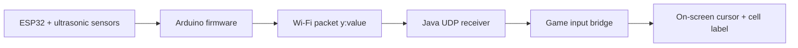

# Whack-a-Mole Wireless Sensor Demo

This project is currently set up as a wireless proof-of-concept.

Current working pieces:
- the ESP32 and ultrasonic sensor firmware upload successfully over USB
- the ESP32 can run from an external battery after upload
- the ESP32 sends the sensor position over Wi-Fi
- the Java program receives the wireless position data
- the game shows a simple grid with a visible cursor marker
- the game has start and stop controls

The goal of this version is to prove the full hardware-to-screen loop:

ESP32 sensor reading -> Wi-Fi packet -> Java game -> cursor update -> visible grid

## Current behavior

The ESP32 sends a direct `y:` value over Wi-Fi.
The Java game uses that Y value to place the cursor in one of three rows.
The cursor stays in a single fixed column on the right side of the grid.

That keeps the demo easy to verify visually while still proving that the player
position is being updated from the sensor data.

Example values:

```text
y:28.4 -> C1
y:64.3 -> C3
```

The game also shows the latest wireless packet it received so you can debug the
pipeline directly inside the game window.

## Project flow



## File overview

### `SensorF/SensorF_WiFi.ino`
ESP32 wireless firmware.

What it does:
- reads the ultrasonic sensors
- connects to Wi-Fi
- sends the Y sensor value as a UDP packet
- keeps running from battery after upload

You upload this sketch once over USB, then the ESP32 can be powered by an
external battery.

### `src/whackamole/UdpSensorReader.java`
Java helper that listens for the wireless packets.

What it does:
- opens a UDP port on the PC
- receives packets from the ESP32
- forwards each packet into the game as text

### `src/whackamole/SensorInputBridge.java`
The game-side parser and mapper.

What it does:
- accepts direct lines like `y:64.3`
- converts the Y value into one of three 30 cm buckets
- maps that bucket into a fixed right-hand column
- produces the cursor position used by the game

### `src/whackamole/GamePanel.java`
The game board and renderer.

What it does:
- draws the 3x3 grid
- draws the green cursor marker
- shows the current cell label
- shows the last wireless packet received
- runs the game timer and scoring loop

### `src/whackamole/GameFrame.java`
The top-level window.

What it does:
- shows score, level, and time
- provides `Start` and `Stop` buttons

## How the mapping works

The Y value is divided into 30 cm intervals:

- `0` to `29.9` -> row 1
- `30` to `59.9` -> row 2
- `60` to `89.9` -> row 3

The cursor stays in one fixed column on the right side of the board.

So the current demo behaves like a simple vertical position test:

- smaller Y values move the cursor to the upper row
- larger Y values move it downward through the grid
- the X reading is ignored for cursor placement in this test mode

## How to run it

### 1. Upload the ESP32 sketch

1. Open Arduino IDE.
2. Select the correct board in **Tools > Board**.
3. Open `SensorF_WiFi.ino`.
4. Fill in your Wi-Fi name, Wi-Fi password, and the IP address of the PC.
5. Upload the sketch over USB.

After upload, disconnect USB if you want and power the ESP32 from an external
battery.

### 2. Install Java and run the game

From the `mole-game` folder:

```powershell
javac -d bin src/whackamole/*.java
java -cp bin whackamole.Main
```

### 3. Use the game controls

- `Start` begins the round timer and scoring loop.
- `Stop` stops the round.
- The grid and cursor remain visible for debugging.

## Debugging the wireless path

When the system is working, you should see all of the following:

- the ESP32 connects to Wi-Fi
- the game window shows a yellow `Cell: ...` label
- the game window shows the latest wireless packet under the cell label
- a green cursor marker appears in the board

If the game shows `Wireless: waiting...`, the PC is not receiving UDP packets.

If the game receives packets but the cursor does not move, the issue is in the
parsing or mapping layer, not the ESP32 Wi-Fi code.

If the ESP32 does not connect, check the Wi-Fi credentials and the PC IP address
inside `SensorF_WiFi.ino`.

## Current project status

This is the current standing of the project:

- ESP32 sensor and firmware side: working
- wireless packet sending from ESP32: set up in the Wi-Fi sketch
- Java game receiving sensor value: working through UDP
- cursor position updating from sensor input: working
- start/stop game controls: working
- final gameplay integration: still in progress

That means the project now has a complete proof-of-concept data path from the
sensor hardware into the game window without requiring the ESP32 to stay plugged
into USB after upload.
